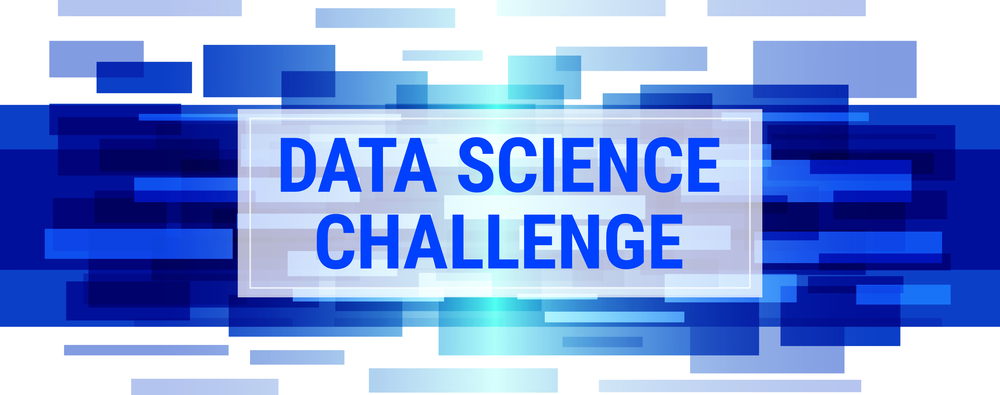

# Data Science Challenges

My solutions to the Data Science Challenges by Giulio Palombo at https://datamasked.com/
(Datasets are not provided here)

## Skills Covered
- Data Wrangling(Pandas)
- Data Visualization(Seaborn and Matplotlib)
- Machine Learning(Sklearn, RandomForest, etc)
- Insight Extraction(PDP Plot)

## Challenge Catalogue
### Insights: Workplace Diversity Analysis
[URL to the notebook](https://github.com/raychn1997/data-science-challenges/blob/test/Insights:%20Workplace%20Diversity%20Analysis/solution.ipynb)

A project that analyzes the fairness of the salary across different genders, departments and experience level.

Tags: People Analytics, Actionable Diversity & Inclusion Analytics
